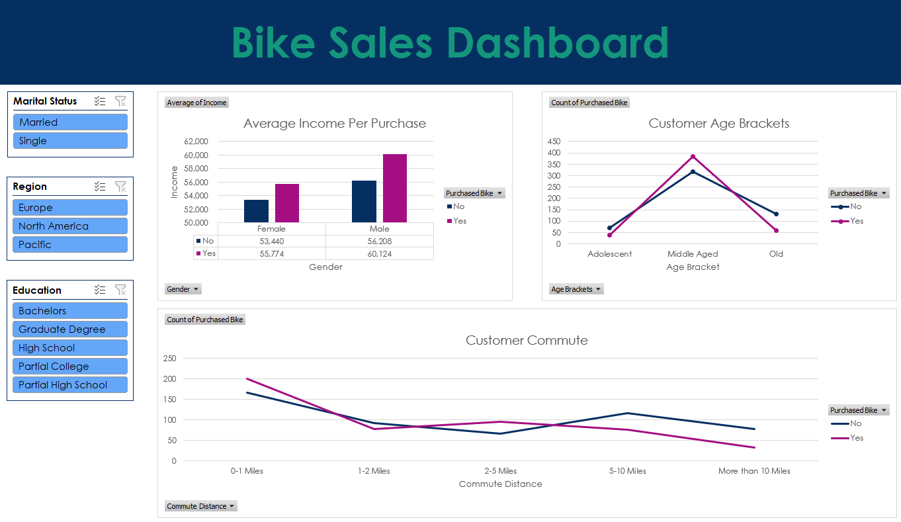

# Excel-Data-Cleaning-Analysis
This project involved creating an informative Excel dashboard using bike sales data.

Key steps included data cleaning, using pivot tables for analysis, applying conditional formatting for insights, and creating charts and graphs for visual representation. Formulas, functions, and lookups were used to enhance data accuracy and usability.

